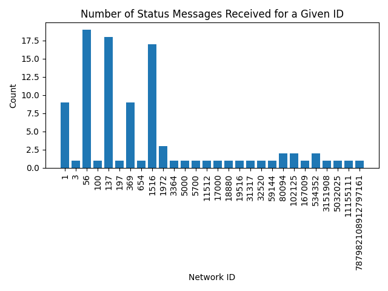
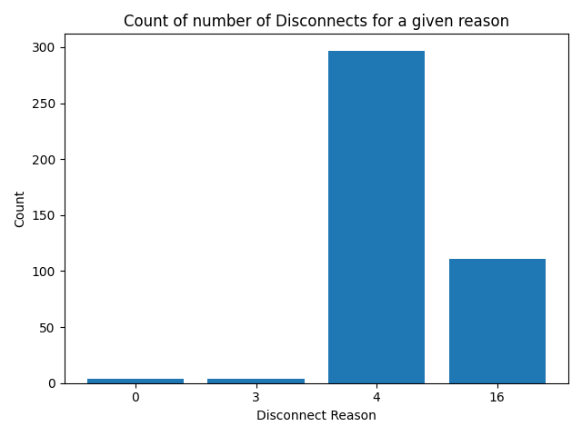

# ETH Discover

## IDEA:

This project aims to create a simple ethereum node, capable of connecting to the network and syncing from GENESIS to the HEAD.

TBD: The data will be stored in some sort of database to enable super-fast querying.

## So far:
There are ~3 milestone needed in order to sync:
 - Discovery: find ethereum nodes to connect to
 - RLPx: establish a secure connection to ethereum nodes
 - Eth/Wire: request block data from ethereum nodes

### Discovery:
Discovery seems to work very well. By recursively connecting to nodes and requesting eth peers (IPs / ports), I am able to connect to upwards of 4k nodes.\
One issue I'm encountering is that few of these nodes are mainnet nodes and/or are willing to be connected to (rlpx) - hence it seems important to maintain an active background discovery thread in order to maintain a high number of connections.

### RLPx:
The RLPx part of the protocol is also done. The node can now securely connect to any ethereum node and send data frames.\
I have some general code refactoring to do, especially around my buffer creation - need to look into the most efficient way of reusing buffers in go.

### Eth/Wire:
The first 0x00 Status messages have been received and sent!
Nodes are willing to connect with me and (hopefully TBD) let me download blocks.

One annoying issue I'm encountering is that a lot of random networkIDs seem to be polluting the mainnet DHT, only about 10% of nodes seem to be mainnet and willing to connect.\
I get a lot of rlpx disconnects (0x04 too many peers) presumably from mainnet nodes - although I cannot tell as I am unable to exchange Status messages with them.\
BSC nodes and strange testnet nodes seem very eager to connect though...\
Notably: 28125, 534352, 137, 369, 100, 56 and 80094 amongst many others

### Some stats:

Running my node for 10mins, I was able to exchange Status messages with 100 nodes.\
During that time I also received 416 disconnects.\
Below I plotted the graphs showing which networks the nodes were advertising and the disconnect  reason.

Disconnect reasons:\
0x00	Disconnect request\
0x03	Useless peer\
0x10	Some other reason specific to a subprotocol

### Questions:
If a technical eth person stumbles across this, I have some questions / concerns:

1) Why am I able to discover and connect to so many nodes, isn't this a design flaw? I would imagine a bad actor would be able to connect to a lot of nodes this way and harm the network no?

2) It doesn't look like nodes have a good protection against one actor (IP) posing as several nodes (node ID / public key). With ~little modification, this one node instance could have several IDs and would hence be able to connect to even more nodes (as discovery connects you with nodes "close" to you).

## Roadmap:
 - [WIP] discv4 | for finding nodes [ref](https://github.com/ethereum/devp2p/blob/master/discv4.md)
 - [WIP] enr | store for node info [ref](https://github.com/ethereum/devp2p/blob/master/enr.md)
 - [DONE] rlpx | communicate with nodes [ref](https://github.com/ethereum/devp2p/blob/master/rlpx.md)
 - [TODO] wire | get block data from nodes [ref](https://github.com/ethereum/devp2p/blob/master/caps/eth.md)
 - [TODO] database | find the best database / way of storing block data in order to be able to query it super fast

## TODO:
  - general:
    - are there mem leaks??
  - discv4:
    - respond to FindNode messages
    - respond to ENRRequest messages
  - rlpx:
    - refactor

## Rant:
@EF, why do you hide the details about multiplexing snap and eth messages over rlpx :|

Figuring out the needed baseOffset took me way too long...

## Credits:
 - go_ethereum rlp implementation
